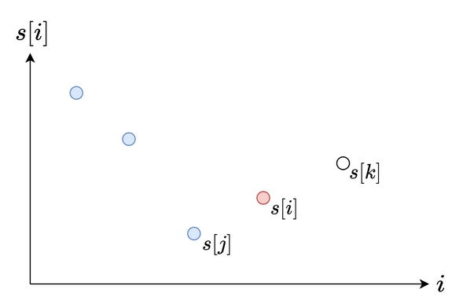

rating: 1908  
from: contest 145 Q3

many specious thoughts

stuck on:  
- find the **farthest** larger number on the right (suffix max + binary search)
- `upper_bound` and `lower_bound` on a decreasing vector

due to the constraints on the left point, monotonous stack works

Unlike finding the **nearest** larger number, which is a typical monotonous stack problem, the iteration order should be reversed.